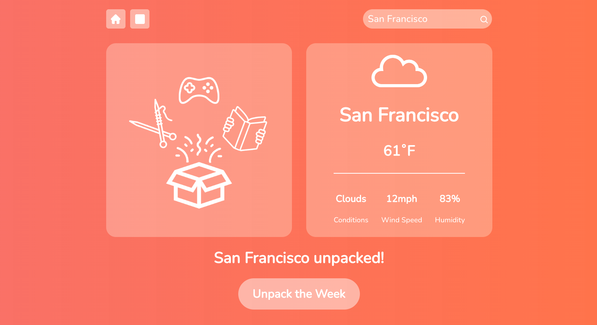

# Weather Box

## Overview:

- Weather Box is an interactive weather application where users can input a name of a city which then 
displays the cities forecast. The theme is based around unpacking a box with weather related contents 
inside. Upon each city inputted, and depending on the daily and weekly forecast given, images will appear 
that represent activities of what is suited best for the selected forecast.

## Live Site:
- https://www.deboer753-weatherbox.com/

## Languages Used:

- HTML
- CSS
- JavaScript
- React.js

